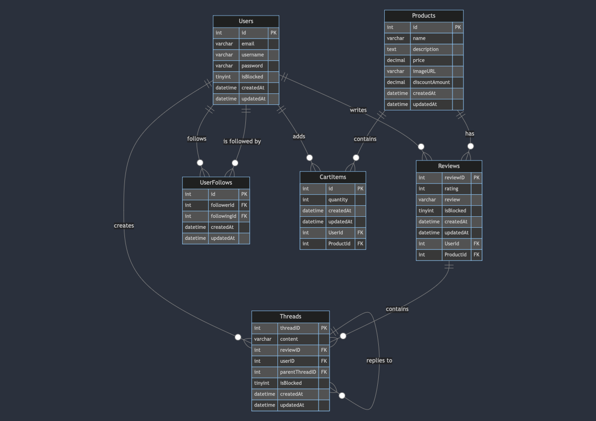

# SOIL

## Members

- Ravel Tanjaya

- Arvin Lee

## Structure

The application is structured in the following ways:

- /application: react frontend/main website
- /api: the rest api for the react frontend (Express + Sequelize)
- /admin-fe: the admin frontend (graphql) - HD
- /admin-graphql: the admin graphql backend - HD

## Starting the application server

As the whole project is made with Javascript, we can just change into the subproject (there is 4 in total) directory and run:

```bash
npm i
# OR 
bun i
```

And then

```bash
npm run dev
# OR
bun run dev
```

> In the case where the application database is cleared (emptied), /api should be run first to propagate the database and run migrations

## Design

### ER



## Implementation Detail

- Password hasing is done using bcrypt algorithm (which is one of the standard used to secure password).
- To make sure that there is no redundant data or unnormalized data in the database, Standard and Special Product is stored on the same database table (Product table), the difference is special product will have the discount value of more than 0.
- The review system is separated into review and thread. Review represent a review and rating that is being given by a user. Thread is the reply (or discussion) that is attached on the review.

### Delete Review

In our opinion in today's world there is a lot of people that will use badwords to show their opinion, which is very inappropriate to be displayed in public website.

The system of review moderation is based on that, we believe that people may have freedom of expression (including expressing their disatisfaction about certain product in a proper way), so we make a system that will detect the use of bad words and put it in the queue to be reviewed by the website admin, who can then delete the review from the system.

The Implementation is done using badwords (an npm package), we will just pass all the reviews through that filtering algorithm and show everything that contains badwords.

Here are a few sample scenario:

- A person complaining about the quality of a product - This is allowed, as we want the customer to be able to give sincere feedback
- A person uses badwards to mock the website - This will be in the moderation list because the system detects the badword and the will be deleted by admin
- A person accidentally mistyped something that makes it sounds like a bad word - This will still go to the admin, but they can choose not to block it because this is a mistake

### Live Dashboard

The 2 Metrics that we choose to displsay is as follows:

- Rating distribution (in Pie Chart): We want to be able to see how the products in the website is performing in general, We can see if people are satisfied with the quality of most the product or do we need to improve the overall quality.
- Product with most review (In grid): We want to to be able to see which product has most review, so that we can check if it is popular or controversial and take steps according to it. (for example increase the stock of popular item, and help customer to resolve problem if it is a controversial one)

## Resources

The following are resource used in the project:

- Icon: https://iconoir.com/

- Organic Food Article: https://www.betterhealth.vic.gov.au/health/healthyliving/organic-food

- Quotes:
  
  - ABC - tips for growing fruits and veggies at home:
    [https://www.abc.net.au/everyday/tips-for-growing-fruit-and-vegetables-at-home/10051592]()
  - ABC - mistakes new garderners make:
    [https://www.abc.net.au/everyday/mistakes-new-gardeners-make-and-how-to-avoid-them/11224022]()
  - ABC - signs your plant is struggling:
    [https://www.abc.net.au/everyday/signs-your-plant-is-struggling-and-how-to-save-them/11324798]()

- Products and images: All of the photos not mentioned, used in the product come from [https://unsplash.com/]()
